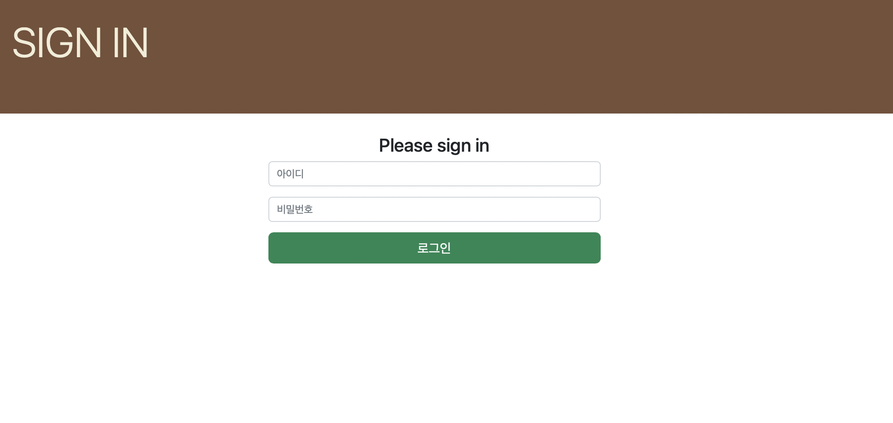
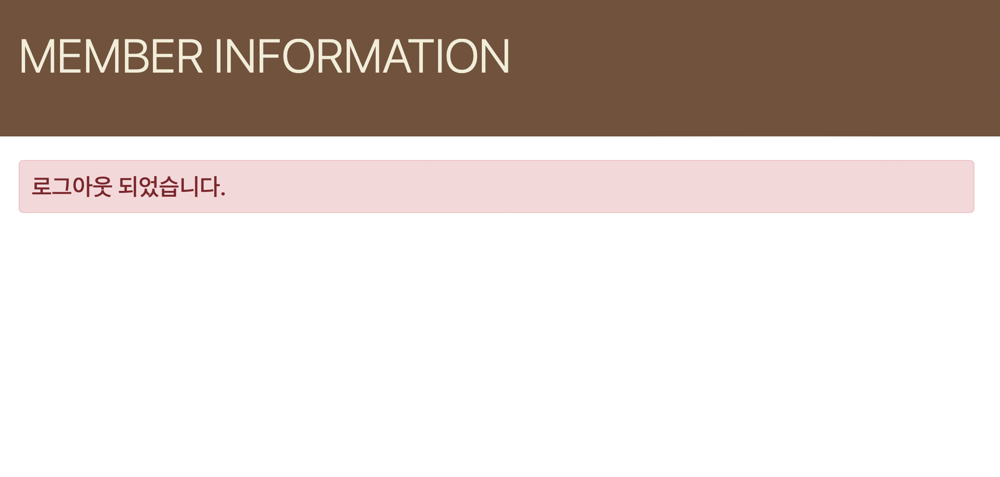
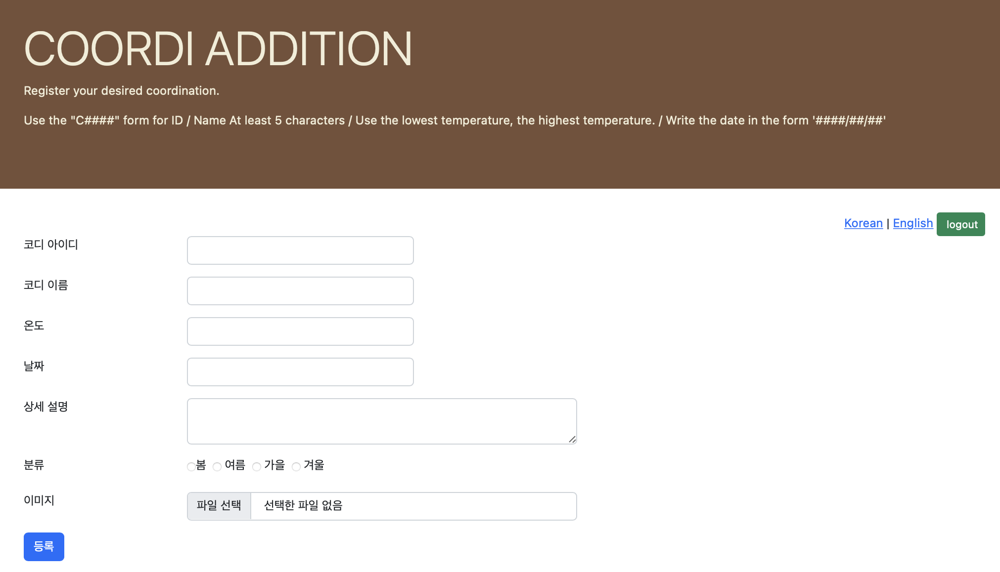
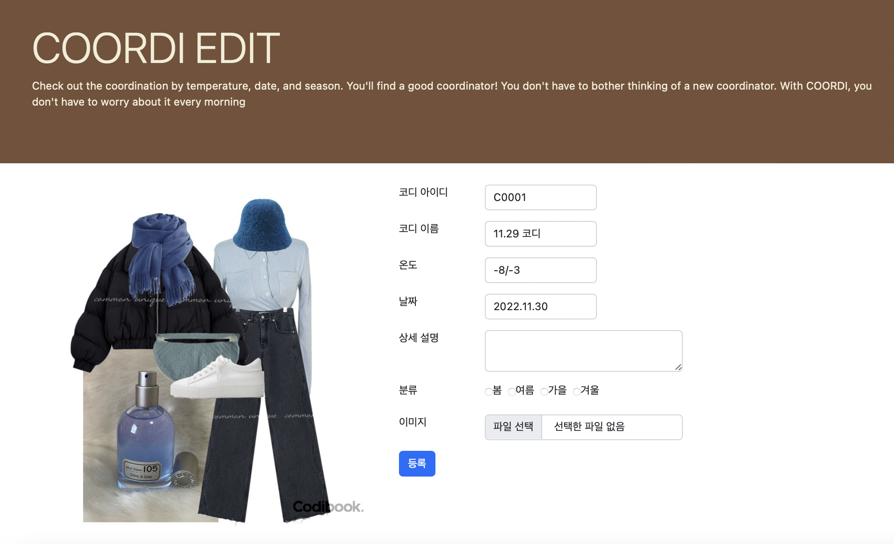

# COORDI

사람들에게 기온별, 상황별, 날짜별 옷차림을 추천해주는 웹이다.

## 1. 회원가입, 로그인, 로그아웃

### 회원가입
- addMember.jsp / processAddMember.jsp 파일에서 동작
- 아이디, 비밀번호, 비밀번호, 이름, 성별, 생년월일, 이메일, 전화번호, 주소 입력
- 받은 정보는 member 데이터베이스에 저장
- 회원가입 성공시 resultMember.jsp?msg=1를 통해 회원가입 메시지 출력

 
### 로그인
- loginMember.jsp / processLoginMember.jsp 파일에서 동작
- 회원가입 하면서 받은 아이디와 비밀번호를 바탕으로 동작하며, 아이디, 비밀번호가 틀릴 시 다시 로그인 화면으로 돌아간다.
- 로그인 후 상단에 로그인 한 아이디와 마지막 접속 시간을 보여준다.

### 로그아웃
- logoutMember.jsp 파일에서 동작
- resultMember.jsp?msg=3를 활용해 로그아웃 메시지 출력

## 2. 추가 및 수정

### 추가
- addCoordi.jsp / processAddCoordi.jsp 파일에서 동작
- coordi.jsp / coordis.jsp 파일에서 확인 가능
- 코디 아이디, 코디 이름, 온도, 날짜, 상세 설명, 분류, 이미지 입력 및 업로드
- 시큐리티를 이용해 관리자만 접근 가능

### 수정
- editCoordi.jsp / updateCoordi.jsp / processUpadateCoordi.jsp 파일에서 동작
- coordi.jsp / coordis.jsp 파일에서 확인 가능
- 코디 이름, 온도, 날짜, 상세 설명, 분류, 이미지 수정 가능
- 시큐리티를 이용해 관리자만 접근 가능
